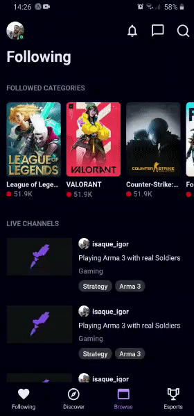

<h1 align="center">
UI Clone (Mobile) - Twitch App
</h1>

Twitch App Homepage UI clone for study purposes.

 

  

  
  

## Layout

 

## Techs

- [x] Expo
- [x] React Native
- [x] Styled Components
- [x] TypeScript

## Starting Dev Environment

1. Run `npm install` or `yarn install`. 
2. Run `yarn start`. 

Made by Isaque Igor
